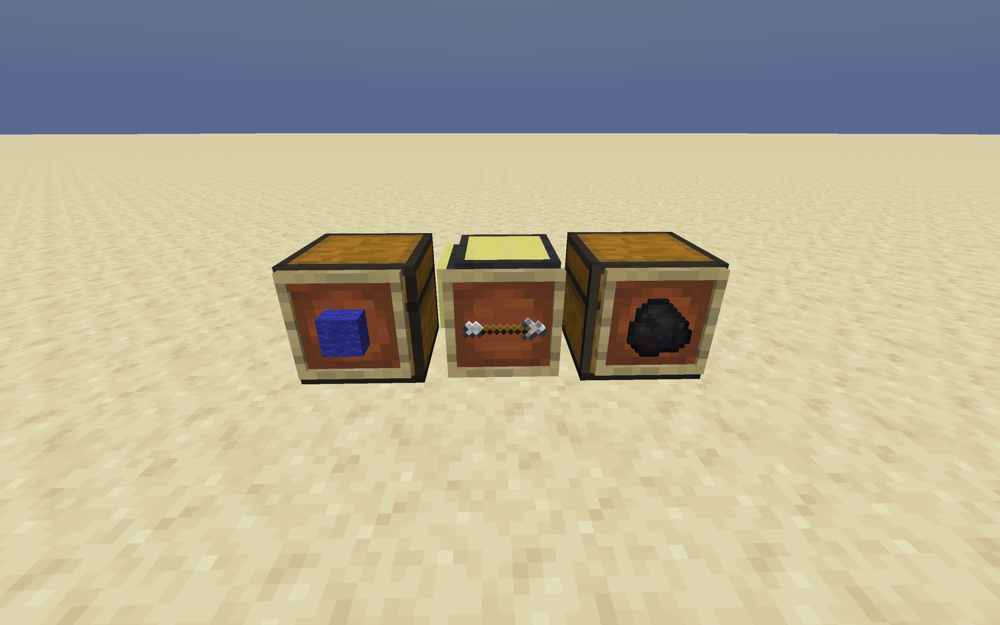

## ComputerCraft Turtle Constructor

----

### Description

Generates a Lua script to build a structure given in a `.nbt` format using ComputerCraft turtles.

This collection of scripts takes a `.nbt` file, converts it into a more useful `.json`, then performs a modified BFS on each layer to find the most efficient path for the turtle to take to build the structure. This path is then converted into a series of instructions for the turtle to take, which is then written to a `.lua` file, the language used by ComputerCraft.

### Files

* nbt_to_json.py
  * Uses the `pythonnbt` library to convert an NBT schematic into a JSON format.
* json_to_arrays.py
  * Converts the JSON of the build into typed nested arrays to be used algorithmically
* arrays_to_path.py
  * Generates an optimized path for the turtle to take using BFS that takes into account refueling
* path_to_instructions.py
  * Creates a series of instructions from a path around a 2D surface that instruct the turtle
* instructions_to_lua.py
  * Writes the instructions along with necessary helper functions to a `.lua` file
* functions.lua
  * Functions that are shared with each Lua program

### Development Workflow

1. Spin up a local http server to download the files in MC using CC's http request API
   * `python3 -m http.server 8000`
2. Edit ComputerCraft config to allow localhost connections - comment out these lines in `.../minecraft/saves/SaveName/serverconfig/computercraft-server.toml`
```
[[http.rules]]
	host = "$private"
	action = "deny"
```
3. Put the following code in a pastebin, or just plug it into a turtle. (Can then put it on a Floppy in-game)
```lua
local request = http.get("http://localhost:8000/build.lua")
local text = request.readAll()
local file = fs.open("out.lua", "w")
file.write(text)
file.close()
```
4. Put the `.nbt` structure file in the data folder and update the path to it in `main.py`
5. Run `python3 main.py`
6. Run the previously created program in-game to download `build.lua` to the turtle.
7. Set up the turtle as shown - arrow shows direction of turtle:

8. Fill the coal chest with a bunch of coal / fuel, fill the wool chest with the item to build with
9. Run `out` on the turtle, making sure space is clear - turtle will build to its right and up while facing the coal chest

### Notes / To-do

- Fuel is essentially infinite in practice, however fuel algo needs testing when paired with event of running out of blocks
- Add 3D optimization - right now, shortest path is only computed by layer
- Add multi-block functionality - likely trivial, but annoying and might introduce certain complications - i.e., go and place all blocks of certain type then come back, or place all different blocks in a layer, etc.